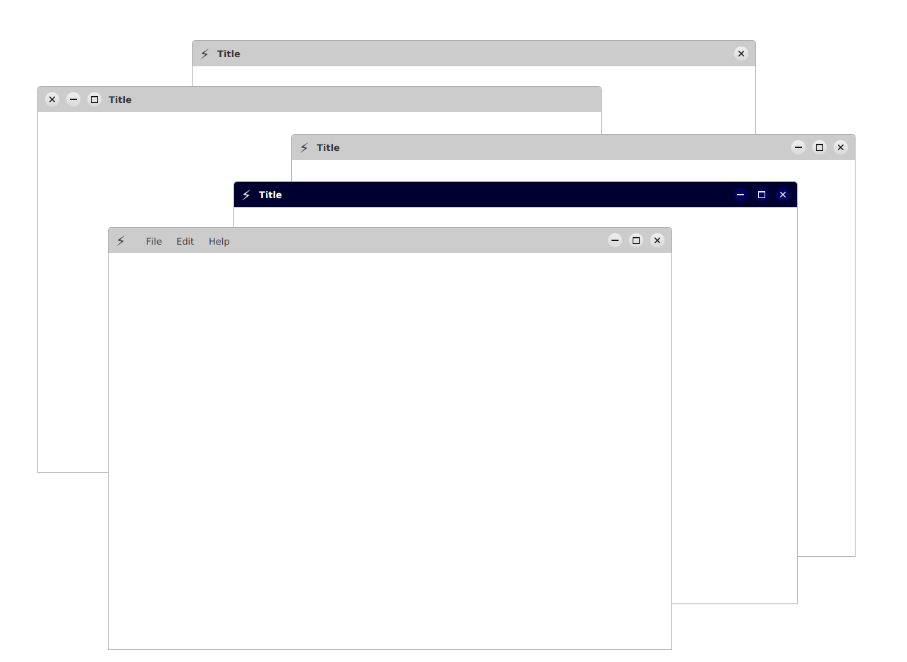

# Techsenger StagePro
* [Overview](#overview)
* [Demo](#demo)
* [Features](#features)
* [Dependencies](#dependencies)
* [Usage](#usage)
* [Code building](#code-building)
* [Running the Sampler](#sampler)
* [License](#license)
* [Feedback](#feedback)

# Overview <a name="overview"></a>

Techsenger StagePro is a library that allows you to create custom stages with nearly any configuration, while remaining
easy to use. The project also includes a sampler module, featuring key samples to help you get started with the library.

# Demo <a name="demo"></a>



# Features <a name="features"></a>

Key features include:

* Fully customizable title bar configurations.
* Support for dynamic configuration changes.
* Ability to place basic buttons on either the left or right side.
* Two policies for the maximize button.
* Styling with CSS.
* Dark mode support.
* Size effect (disabled by default).
* Only two events triggered during resizing (start and finish).

# Dependencies <a name="dependencies"></a>

The project will be added to the Maven Central repository in a few weeks.

# Usage <a name="usage"></a>

To create a standard Stage, use the code below. To explore all features, check out the examples in the sampler.

```
@Override
public void start(Stage stage) {
    var controller = new StandardStageController(stage, 800, 600);
    controller.initialize();
    var content = new VBox(...);
    controller.setContent(content);
    stage.show();
}
```

# Code Building <a name="code-building"></a>

To build the library use standard Git and Maven commands:

    git clone https://github.com/techsenger/stagepro
    cd stagepro
    mvn clean install

# Running the Sampler <a name="sampler"></a>

To run the sampler execute the following commands in the root of the project:

    cd stagepro-sampler
    mvn javafx:run

Please note, that debugger settings are in `stagepro-sampler/pom.xml` file.

# License <a name="license"></a>

Techsenger StagePro is licensed under the Apache License, Version 2.0.

# Feedback <a name="feedback"></a>

Any feedback is welcome. Besides, it would be interesting to know for what cases this project is used. It will
help to understand the way the project should go and provide more information in documentation.


