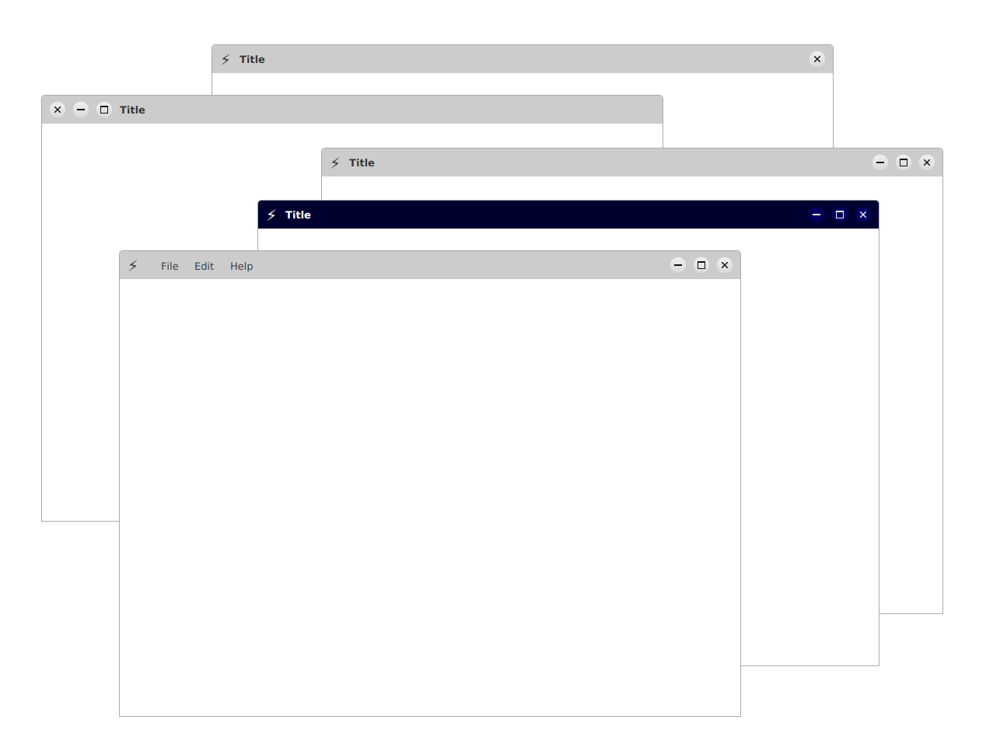

# Techsenger StagePro
* [Overview](#overview)
* [Demo](#demo)
* [Features](#features)
* [Requirements](#requirements)
* [Dependencies](#dependencies)
* [Usage](#usage)
* [Code building](#code-building)
* [Running Sampler](#sampler)
* [License](#license)
* [Contributing](#contributing)
* [Support Us](#support-us)

# Overview <a name="overview"></a>

Techsenger StagePro is a library that allows you to create custom stages with nearly any configuration, while remaining
easy to use. The project also includes a sampler module, featuring key samples to help you get started with the library.

If you like this project and find it useful, please consider [supporting us](#support-us).

# Demo <a name="demo"></a>



# Features <a name="features"></a>

Key features include:

* Fully customizable title bar configurations.
* Support for dynamic configuration changes.
* Ability to place basic buttons on either the left or right side.
* Two policies for the maximize button.
* Styling with CSS.
* Dark mode support.
* Size effect (disabled by default).
* Only two events triggered during resizing (start and finish).

Currently, shadow for Stage is not supported, as it seems there is no way to set a shadow around a Stage using JavaFX.
It is likely that this can only be achieved using native code.

# Requirements <a name="requirements"></a>

Due to some bugs, use JavaFX versions 16–20, or a version of JavaFX after 24-ea+19 (see JDK-8344372).

# Dependencies <a name="dependencies"></a>

The project will be added to the Maven Central repository in a few weeks.

# Usage <a name="usage"></a>

To create a standard Stage, use the code below. To explore all features, check out the examples in the sampler.

```
@Override
public void start(Stage stage) {
    var controller = new StandardStageController(stage, 800, 600);
    var content = new VBox(...);
    controller.setContent(content);
    stage.show();
}
```

# Code Building <a name="code-building"></a>

To build the library use standard Git and Maven commands:

    git clone https://github.com/techsenger/stagepro
    cd stagepro
    mvn clean install

# Running Sampler <a name="sampler"></a>

To run the sampler execute the following commands in the root of the project:

    cd stagepro-sampler
    mvn javafx:run

Please note, that debugger settings are in `stagepro-sampler/pom.xml` file.

# License <a name="license"></a>

Techsenger StagePro is licensed under the Apache License, Version 2.0.

# Contributing <a name="contributing"></a>

We welcome all contributions. You can help by reporting bugs, suggesting improvements, or submitting pull requests
with fixes and new features.

# Support Us <a name="support-us"></a>

You can support us financially through [GitHub Sponsors](https://github.com/sponsors/techsenger). Your
contribution directly helps us keep our open-source projects active, improve their features, and offer ongoing support.
Besides, we offer multiple sponsorship tiers, with different rewards.

You can also give this project a star ⭐, which will help other users find it and increase its popularity.

